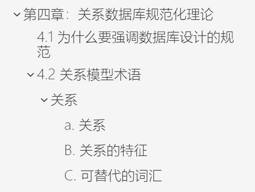

# 1. 烽火计划-数据库系统原理项目

<!-- TOC -->

- [1. 烽火计划-数据库系统原理项目](#1-烽火计划-数据库系统原理项目)
    - [1.1. 描述](#11-描述)
    - [1.2. 项目计划](#12-项目计划)
    - [1.3. 进度](#13-进度)
    - [1.4. 加入我们](#14-加入我们)
        - [1.4.1. 汉化工作](#141-汉化工作)
        - [1.4.2. 校对工作](#142-校对工作)
    - [1.5. 推荐软件](#15-推荐软件)
        - [1.5.1. Typora](#151-typora)
        - [1.5.2. CopyTranslator](#152-copytranslator)
        - [1.5.3. 腾讯QQ / Snipaste](#153-腾讯qq--snipaste)
    - [1.6. 排版要求（汉化、校对人员必看）](#16-排版要求汉化校对人员必看)
        - [1.6.1. 图片存储位置](#161-图片存储位置)
        - [1.6.2. 中英对照](#162-中英对照)
        - [1.6.3. 目录结构](#163-目录结构)
        - [1.6.4. 高亮关键字](#164-高亮关键字)
        - [1.6.5. 换行统一化](#165-换行统一化)
        - [1.6.6. 公式独立化](#166-公式独立化)
        - [1.6.7. 键标记统一化](#167-键标记统一化)
        - [1.6.8. 重点统一化](#168-重点统一化)
        - [1.6.9. 表格汉化](#169-表格汉化)
        - [1.6.10. 专有名词同步](#1610-专有名词同步)
        - [1.6.11. 独立标题](#1611-独立标题)
        - [1.6.12. 适当的图片大小](#1612-适当的图片大小)
        - [1.6.13. 代码块独立化](#1613-代码块独立化)

<!-- /TOC -->

## 1.1. 描述

一个对数据库系统原理教材的全面汉化项目。由咸某人牵头并赞助，目的在于帮助更好的理解数据库系统原理。

## 1.2. 项目计划

包括一份的汉化文档和一份专用名词速查字典，后期将推出csdn版。

## 1.3. 进度

- [x] 第一章
- [x] 第二章
- [x] 第三章
- [x] 第四章
- [x] 第五章

## 1.4. 加入我们

**高贡献组员可以获得咸某人赞助的 奶茶兑换津贴 哦！**

### 1.4.1. 汉化工作

欢迎上传你的汉化文件！

### 1.4.2. 校对工作

汉化是一个复杂的工作，同时进行汉化、美化、格式控制很容易出现纰漏。在细节方面，很多小点都有不完善的地方，希望大家能帮助我们修补文档，共同完善项目。

## 1.5. 推荐软件

### 1.5.1. Typora

用于编撰md文档。功能强大！[官网直达](https://typora.io/)

### 1.5.2. CopyTranslator

用于基础部分的翻译（本人采用的是机翻+人工校对调整模式）[官网直达](https://copytranslator.github.io)

### 1.5.3. 腾讯QQ / Snipaste

主要用来截图

## 1.6. 排版要求（汉化、校对人员必看）

为了保证格式的一致性和美观性，现提出如下要求。

### 1.6.1. 图片存储位置

采用Typora的设置，直接粘贴截图进文档即可

### 1.6.2. 中英对照

因为考试采用英文试卷，为方便理解以及锻炼英语读题能力，请始终保持中英对照。

英语部分使用“引用格式”*（GFM语法：> + 原文）*

汉化部分保持原样即可

### 1.6.3. 目录结构

为了方便查找，在typora中，使用[toc]自动生成目录，在编纂时要注意管理目录结构。

主要注意区分章节之间层次关系，切勿一个段落等级走到黑。

*GFM语法：# + 标题内容（#的个数代表标题等级，最大为1级）*

### 1.6.4. 高亮关键字

为了便于区分关键字，在文中出现的（不论中英文）均需高亮。

*（GFM语法：\=\= + 高亮内容 + \=\=）*

### 1.6.5. 换行统一化

在Typora中，如果直接复制粘贴文字，文字中的换行是以”紧凑形式“呈现的（在源代码中是单个换行）

而按Enter则是”宽松形式“（在源代码中有一个空行隔开各行）

为保证形式上的统一，请统一使用宽松形式的换行。

### 1.6.6. 公式独立化

为保证公式（包括且不限于表结构、关系、计算式、SQL语句）的突出地位，所有公式均需单行独立显示。

同时为了保证不出现误解，所有公式、表格的键名请不要做汉化，直接复制即可。

对于汉化文本中出现的单词，请用空格包裹，以增加可阅读性。

### 1.6.7. 键标记统一化

主键下划线，外键斜体，与教材中保持一致。

*（GFM语法：\<u\> + 主键 + \<u\>）*

*（GFM语法：\* + 外键 + \*）*

### 1.6.8. 重点统一化

教材内重点画的比较滥，起不到标志作用。汉化人员可以根据自己的理解加粗重点。（只加粗汉化部分即可）

### 1.6.9. 表格汉化

对于包含专有名词，步骤指示等重要信息的表需要进行汉化，其他普通的数据表不需要汉化。

### 1.6.10. 专有名词同步

在高亮的时候请同时添加专有名词及其翻译到 专有名词速查手册中。

并在翻译的过程中保持一致的翻译，避免产生歧义。

### 1.6.11. 独立标题

为突出标题的作用范围，在翻译过程中，遇到”小标题“+正文的结构时，请单独将小标题放在原文前面。

### 1.6.12. 适当的图片大小

过大的图片看着很不舒服，在Typora中右键即可调整缩放。

### 1.6.13. 代码块独立化

在遇到SQL语句时，请使用代码块包裹语句。

*（GFM语法：\`\`\` + 代码块 + \`\`\`）*

